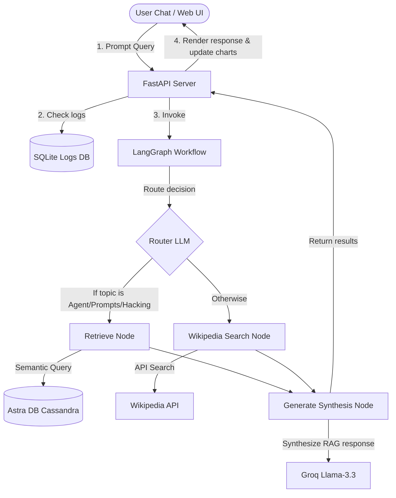

# Info Finder: RAG Router Agent & Telemetry Dashboard

> 👨‍💻 **Made by [Omkar Prajapati](https://github.com/omkar-prajapati)**

An end-to-end, production-grade Retrieval-Augmented Generation (RAG) system built with **FastAPI**, **LangGraph**, **Astra DB (Cassandra)**, and **Groq LLM (Llama 3.3)**.

The application dynamically routes queries: questions about **AI Agents, Prompt Engineering, or Adversarial Attacks** are routed to custom-crawled documentation inside **Astra DB**, while general-knowledge questions are routed directly to the **Wikipedia Search API**. A premium glassmorphic telemetry dashboard visualizes query logs, route decisions, response timings, and crawling actions.

🚀 **Live Demo (Railway):** [https://p1-production.up.railway.app](https://p1-production.up.railway.app) ← _replace with your actual URL_

---

## ⚡ Key Features

- **Dynamic Query Routing**: Built using LangGraph conditional edges and structured LLM JSON outputs (with automatic regex/keyword fallback heuristics if Groq API keys are absent).
- **Astra DB Vector Indexing**: Scalable document storage utilizing Datastax Astra DB and local HuggingFace embeddings (`all-MiniLM-L6-v2`) via CassIO.
- **Synthesized Generations**: Responses are framed using a Groq Llama-3.3 prompt structure highlighting direct reference sources.
- **Telemetry Logger (SQLite)**: Automatically caches every search, timing latency metrics, route choices, and context passages.
- **Premium Glassmorphic Dashboard**: Beautiful web control console utilizing responsive grid panels, inline SVGs, and real-time Chart.js metrics.
- **Dynamic Ingestion Crawler**: Input any URL in the UI to crawl, tokenize, split, and index it into the vector database in real time.

---

## 🏗️ Architecture Flow



---

## 📂 Project Structure

```
p1/
├── app/
│   ├── __init__.py
│   ├── config.py            # Environment configurations & defaults
│   ├── database.py          # SQLite & Astra DB CassIO connections
│   ├── ingest.py            # BeautifulSoup crawler and splitting utilities
│   ├── agent_workflow.py    # LangGraph state machine, nodes, edges & LLM calls
│   └── main.py              # FastAPI server and static folder mounting
├── static/                  # Glassmorphic Front-End UI
│   ├── index.html           # Dashboard views, chatbot interface, status lights
│   ├── css/
│   │   └── style.css        # Premium dark-theme CSS style sheets
│   └── js/
│       └── app.js           # API request bindings and Chart.js animations
├── .env.example             # Setup template for API keys
├── .gitignore               # Ignored local files, databases, and dependencies
├── LICENSE                  # Open-source MIT License
├── requirements.txt         # Required Python packages
├── test_app.py              # Unit tests for verification
└── Info_finder_using_Astra_Db (1).ipynb  # Original Jupyter notebook
```

---

## ⚙️ Quick Start

### 1. Prerequisites
Ensure you have Python 3.9+ installed on your system.

### 2. Install Dependencies
Clone the repository and install the packages listed in `requirements.txt`:
```bash
pip install -r requirements.txt
```

### 3. Configure API Credentials
Create a `.env` file in the root directory based on the `.env.example` template:
```bash
cp .env.example .env
```
Provide your API keys:
- **Groq API Key**: Get one from the [Groq Console](https://console.groq.com/).
- **Astra DB Token & Database ID**: Obtain these by creating a free vector database instance on the [DataStax Astra Portal](https://astra.datastax.com/).
*(Note: If you leave the Astra DB credentials as default, they will connect to the demo database provided in the notebook).*

### 4. Index Initial Seed Web Data
Run the crawler script to scrape and index Lilian Weng's blogs on LLM agents, prompt engineering, and adversarial vulnerabilities into your Astra DB table:
```bash
python app/ingest.py
```

### 5. Launch the Server
Start the FastAPI server:
```bash
python app/main.py
```

Open your browser and navigate to **`http://127.0.0.1:8000`** to view the live dashboard and interact with the RAG agent!

---

## 🧪 Verification & Testing

Execute the automated test script to verify imports, schema generations, and heuristic routing setups:
```bash
python test_app.py
```

---

## 📄 License

This project is licensed under the **MIT License with Ethical Use Addendum** — see the [LICENSE](LICENSE) file for full details.

> ⚠️ **Usage Restriction:** This software may only be used for lawful, ethical, and constructive purposes. Any use that causes harm, spreads misinformation, facilitates cyberattacks, or violates applicable law is strictly prohibited. All rights reserved by **Omkar Prajapati**.

---

## 👨‍💻 Author

**Omkar Prajapati**

- 🚀 **Live Deployment (Railway):** [https://p1-production.up.railway.app](https://p1-production.up.railway.app) ← _replace with your actual URL_
- 💻 Built with FastAPI, LangGraph, Astra DB & Groq LLM
